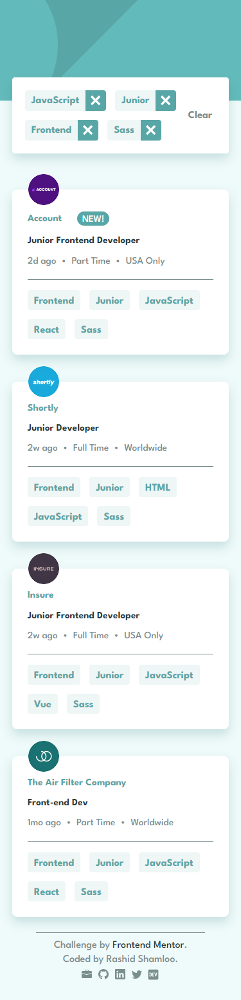

# Front End Mentor - Project 035 - Job listings with filtering

This is a solution to the [Job listings with filtering challenge on Frontend Mentor](https://www.frontendmentor.io/challenges/job-listings-with-filtering-ivstIPCt).

## Table of contents

- [Overview](#overview)
  - [Screenshot](#screenshot)
  - [Links](#links)
- [My process](#my-process)
  - [Built with](#built-with)
  - [Tested with](#tested-with)
  - [Related blog posts](#related-blog-posts)
  - [What I learned](#what-i-learned)
- [Author](#author)

## Overview

### Screenshot

- Desktop

- Mobile

### Links

- Solution URL: https://github.com/rashidshamloo/fem_035_job-listings-with-filtering/
- Live Site URL: https://joblistings-rashidshamloo.vercel.app/
- API Endpoint: https://joblistings-rashidshamloo.vercel.app/api

## My process

### Built with

- TypeScript
- React
- Next.js
- Styled Components
- Redux Toolkit
- Framer Motion
- Zod

### Tested with

- Cypress (component & e2e)

### Related blog posts

- [Preventing the Layout Shift Caused by Scrollbars](https://dev.to/rashidshamloo/preventing-the-layout-shift-caused-by-scrollbars-2flp)

- [Using Styled-Components with Next.js v13 (TypeScript)](https://dev.to/rashidshamloo/using-styled-components-with-nextjs-v13-typescript-2l6m)

- [Testing the Redux Store using Cypress in Next.js (TypeScript)](https://dev.to/rashidshamloo/testing-the-redux-store-using-cypress-in-nextjs-typescript-1k6o)

### What I learned

- Adding CORS to Next.js v13 API endpoints
- Styled-Components
- Redux Toolkit
- Redux Toolkit Thunk
- Zod
- e2e testing using Cypress

## Author

Rashid Shamloo

- Portfolio - [rashidshamloo.ir](https://www.rashidshamloo.ir)
- Linkedin - [rashid-shamloo](https://www.linkedin.com/in/rashid-shamloo/)
- Frontend Mentor - [@rashidshamloo](https://www.frontendmentor.io/profile/rashidshamloo)
- Twitter - [@rashidshamloo](https://www.twitter.com/rashidshamloo)
- Dev.to - [@rashidshamloo](https://dev.to/rashidshamloo)
